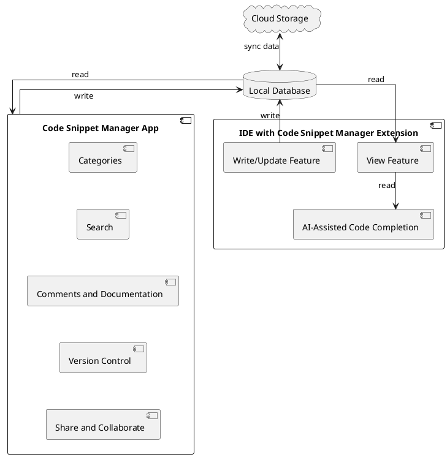

---
foam_template:
  name: Docs Docusaurus Template
  description: Creates Docusaurus docs/slip
  filepath: docs/code-snippet-management.md
sidebar_label: Code Snippet Management
description: Code Snippet Management
keywords:
  - code snippet manager
image: https://i.imgur.com/mErPwqL.png
tags:
  - code snippet
last_update:
  date: 2023-06-26
  author: frank
---

# Code Snippet Management

