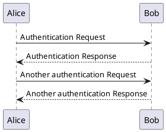
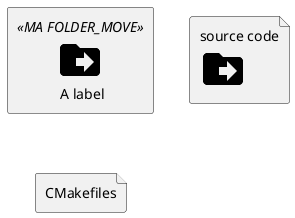
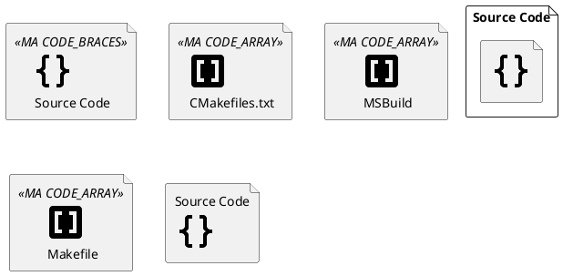

# Your markdown including PlantUML code block

```plantumlcode
@startuml
:User: --> (Use)
"Main Admin" as Admin
"Use the application" as (Use)
Admin --> (Admin the application)
@enduml
```


```plantuml
@startuml
Alice -> Bob: Authentication Request
Bob --> Alice: Authentication Response

Alice -> Bob: Another authentication Request
Alice <-- Bob: Another authentication Response
@enduml
```


```plantuml
@startuml
!include <material/common>
' To import the sprite file you DON'T need to place a prefix!
!include <material/folder_move>

MA_FOLDER_MOVE(Black, 1, dir, rectangle, "A label")

file "source code\n<$ma_folder_move>" as code
file CMakefiles
@enduml
```


```plantuml
@startuml
!include <material/common>
!include <material/code_braces>
!include <material/code_array>
!include <material/code_brackets>
!include <material/code_parentheses>
!include <material/code_tags>

MA_CODE_BRACES(Black, 1, source, file, "Source Code")
MA_CODE_ARRAY(Black, 1, cmake, file, "CMakefiles.txt")
MA_CODE_ARRAY(Black, 1, make, file, "Makefile")
MA_CODE_ARRAY(Black, 1, msbuild, file, "MSBuild") {
}

file Source[
Source Code
<$ma_code_braces>
]

file "Source Code" {
    file "<$ma_code_braces>"
}
@enduml
```