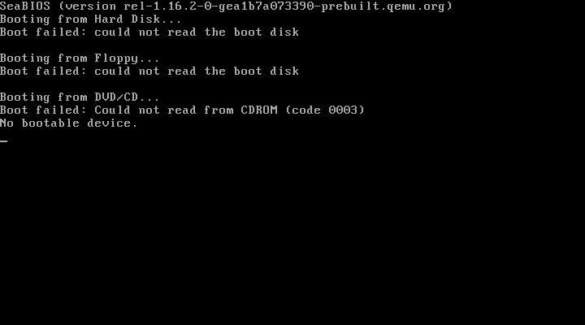
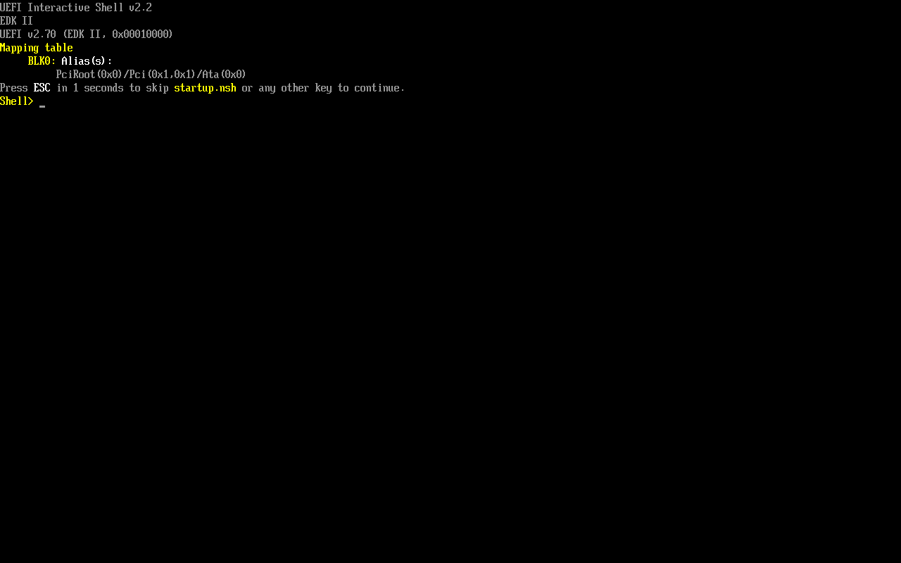

---
authors:
  - frank
tags:
  - wiki
  - qemu
description: Wiki QEMU
keywords:
  - Wiki QEMU
image: https://i.imgur.com/mErPwqL.png
date: 2023-09-19
draft: false
enableComments: true # for Gisqus
---

# QEMU

Learning and using the QEMU help me understand how the linux operating system works including fields:

1. Linux boot process.
2. Cross compile for target system(such as arm64) on host system(such as x86_64), and test the binary.

[UEFI, PC boot process and UEFI with QEMU | joonas.fi](https://joonas.fi/2021/02/uefi-pc-boot-process-and-uefi-with-qemu/)

https://medium.com/@ThyCrow/compiling-the-linux-kernel-and-creating-a-bootable-iso-from-it-6afb8d23ba22

https://levelup.gitconnected.com/probably-the-simplest-way-to-install-debian-ubuntu-in-qemu-2db6afde27ef

[UEFI on AARCH64 | Welcome to the Mike’s homepage!](https://krinkinmu.github.io/2020/11/21/EFI-aarch64.html)

[OVMF · tianocore/tianocore.github.io Wiki · GitHub](https://github.com/tianocore/tianocore.github.io/wiki/OVMF)

https://wiki.debian.org/Arm64Qemu

http://cdn.kernel.org/pub/linux/kernel/people/will/docs/qemu/qemu-arm64-howto.html

https://futurewei-cloud.github.io/ARM-Datacenter/qemu/how-to-launch-aarch64-vm/

https://xryan.net/p/212

## OS image Resources

- [Ubuntu OS Images](https://cdimage.ubuntu.com/)
- [Debian OS Images](https://cdimage.debian.org/)


<!--truncate-->


## Create disk image

```sh
qemu-img create -f raw ubuntu.raw 20G
qemu-img create -f qcow2 ubuntu.qcow2 20G
```

QEMU can boot from 3 ways:

- BIOS in default
- Linux kernel and initrad
- UEFI

For **UEFI** boot, the `-bios` option should be used alongside `UEFI` firmware(`OVMF.fd` file) being provided to help QEMU do `UEFI` boot. For instance it is like: `-bios OVMF.fd`.

Get a prebuilt `OVMF` file from the [OVMF](https://www.kraxel.org/repos/jenkins/edk2/).

## BIOS boot

Test entering BIOS,

```sh
qemu-system-x86_64 -monitor stdio -m 1G
```

Then QEMU will show like this,




## Kernel boot

## UEFI boot

### Test UEFI boot

aarch64,

```sh
efi="$PWD/UEFI/aarch64/QEMU_EFI.fd"

qemu-system-aarch64 -monitor stdio -M virt -cpu cortex-a57 -m 1G -net none -bios $efi

qemu-system-aarch64 -nographic -M virt -cpu cortex-a57 -m 1G -net none -bios $efi
```

x86_64,

```sh
efi="$PWD/UEFI/ovmf-x64/OVMF-pure-efi.fd"

qemu-system-x86_64 -monitor stdio -m 1G -net none -bios $efi
```

Then QEMU will drop into the **UEFI** shell, like this following image show,



Options in detail:

- `-nographic`: Don't create a video for the VM, just use the terminal.
:::info
quit QEMU: `Ctrl+A X`.  
enter QEMU monitor console: `Ctrl+A C`.  
see at [How to quit the QEMU monitor when not using a GUI?](https://superuser.com/questions/1087859/how-to-quit-the-qemu-monitor-when-not-using-a-gui)
:::

- `-monitor stdio`: Put QEMU monitor console in the terminal, while guest OS kept in created video device.
:::info
switch between monitor console and guest OS: `Ctrl+Alt+1` or `Ctrl+Alt+2`.
:::

- `-net none`: Disable iPXE.

### Boot x86_64 ISO image

Boot x86_64 image in Windows,

```sh
efi="$PWD/UEFI/ovmf-x64/OVMF-pure-efi.fd"
iso=ubuntu-22.04-live-server-amd64.iso
```

:::note
`ubuntu-**-amd64.iso` support both **UEFI** and Legacy **BIOS** boot, QEMU use **BIOS** when the option `-bios` is not specified!
:::

1. Create a disk image to install the ubuntu OS,

```sh
qemu-img create -f qcow2 ubuntu-image.qcow2 20G
```

2. Boot to run the Ubuntu OS

```sh
qemu-system-x86_64 \
    -monitor stdio \
    -accel whpx \
    -m 8G \
    -smp 4 \
    -drive file=ubuntu-image.qcow2 \
    -bios $efi \
    -cdrom $iso
```

Options in details,

- `-accel whpx`: use hardware acceleration

3. [?]Boot the installed Ubuntu OS

```sh
# Install OS into a disk image
qemu-system-x86_64 \
    -accel whpx \
    -m 8G \
    -smp 4 \
    -bios $efi \
    -drive file=ubuntu.qcow2,format=qcow2,if=virtio \
```

### Boot aarch64 ISO image

Emulate aarch64 ISO image in Windows,

```sh
efi="$PWD/UEFI/aarch64/QEMU_EFI.fd"
iso="ubuntu-22.04-live-server-arm64.iso"

qemu-system-aarch64 \
    -monitor stdio \
    -machine virt \
    -cpu cortex-a57 \
    -m 4G \
    -smp 4 \
    -drive file=ubuntu.qcow2,format=raw,if=virtio \
    -bios $efi \
    -cdrom $iso
```

Emulate aarch64 ISO image in mac M1,

```sh
qemu-system-aarch64 \
    -monitor stdio \
    -machine virt \
    -accel hvf \
    -cpu host \
    -m 4G \
    -smp 4 \
    -drive file=ubuntu.qcow2,format=raw,if=virtio \
    -bios $efi \
    -cdrom $iso
``` 

Options in details,

- `-accel hvf`: use hardware acceleration in mac M1.
- `-cpu host`: use mac M1 arm CPU.

### Boot a preinstalled image

```sh
efi="$PWD/UEFI/aarch64/QEMU_EFI.fd"
iso="2020-02-13-raspbian-buster.img"
iso="ubuntu-core-22-arm64+raspi.img"
```

```sh
qemu-system-aarch64 \
    -monitor stdio \
    -machine raspi3b \
    -cpu cortex-a57 \
    -m 1G \
    -smp 4 \
    -net none \
    -bios $efi \
    -sd $iso
```