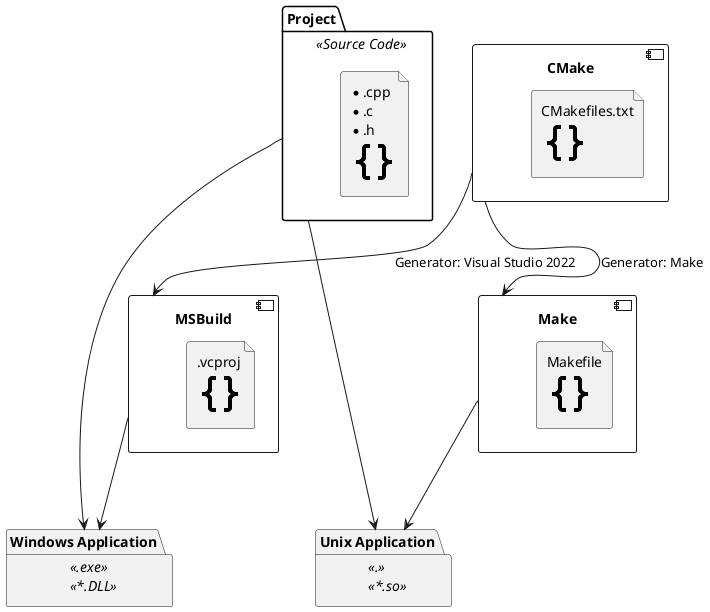

---
authors:
  - frank
tags:
  - make
  - ninja
  - msbuild
  - cmake
  - meson
  - ci-cd
description: Learn Avalonia
keywords:
  - practice
  - avalonia
image: https://i.imgur.com/mErPwqL.png
date: 2023-07-07
draft: false
enableComments: true # for Gisqus
---

# C/C++ Build System

[List of build automation software - Wikipedia](https://en.wikipedia.org/wiki/List_of_build_automation_software)

<!--truncate-->

## Build System

Make

Ninja

MSBuild

## Build System Generator

CMake

Meson

## Package Management

- vcpkg
- conan