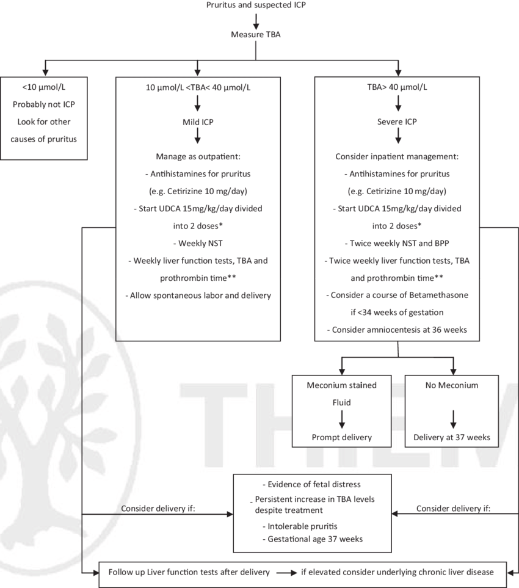

# Penelope

## Intrahepatic Cholestasis of Pregnancy(ICP)

- TBA(Total Bile Acid)
- ICP(Intrahepatic Cholestasis in Pregnancy)

[Intrahepatic Cholestasis in Pregnancy: Review of the Literature](https://www.ncbi.nlm.nih.gov/pmc/articles/PMC7290322/)

### Clinical and biochemical symptoms of ICP

- pruritus
- progressive increased levels of total bile acids (TBA)

severe ICP:
- pruritus
- TBA > 40 μmol/L

### Stillbirth rate of ICP

Ovadia et al. found that for singleton pregnancies, the prevalence of stillbirth was three (0.13%) of 2310 intrahepatic cholestasis of pregnancy cases in women with serum total bile acids of less than 40 μmol/L versus four (0.28%) of 1412 cases with total bile acids of 40–99 μmol/L and versus 18 (3.44%) of 524 cases for bile acids of 100 μmol/L or more [24].Germain et al. observed that bile acids increase the expression and sensitivity of oxytocin receptors in uterine muscles, potentially leading to increased rates of premature deliveries in ICP patients [25].

### Clinical Approach to ICP

[A Clinical Approach to Intrahepatic Cholestasis of Pregnancy](https://www.researchgate.net/publication/235380677_A_Clinical_Approach_to_Intrahepatic_Cholestasis_of_Pregnancy)

## Obstetric Cholestasis(OC)

[Obstetric Cholestasis](https://www.rcog.org.uk/for-the-public/browse-all-patient-information-leaflets/obstetric-cholestasis-patient-information-page/)

some **gists:**

> Recent research has shown that the risk of stillbirth is the same as in women without obstetric cholestasis (1 in 200)

[Obstetric Cholestasis](https://www.tommys.org/pregnancy-information/pregnancy-complications/obstetric-cholestasis)

> Obstetric Cholestasis = ICP
> But recent research suggests that the risk of stillbirth is increased in women with intrahepatic cholestasis of pregnancy carrying 1 baby when bile acids are 100 μmol/L or more. It may be reassuring to hear that most women with ICP have bile acids below this number, so their risk of a stillbirth is similar to that of pregnant women in the general population.

## OC Diagnosis

[Obstetric Cholestasis (OC) diagnosis and management guideline](https://mft.nhs.uk/app/uploads/sites/4/2018/07/Cholestasis.pdf)

Mild Obstetric Cholestasis: bile acids > 14mmol/L
Moderate Obstetric Cholestasis: bile acids > 40mmol/L
Severe Obstetric Cholestasis: bile acids > 100mmol/L
Increasing fetal risks are directly associated with increasing maternal
serum bile acids (Glantz et al, 2004).